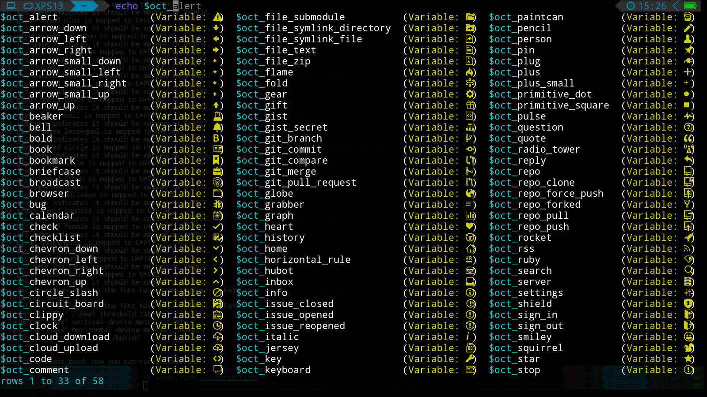

# icons-in-terminal

## Overview

`icons-in-terminal` allows you to get any fonts in your terminal without replacing or patching your font.  
You can add as many fonts as you want easily, you just need the ttf/odf file and add it to `config.json`.  

## Table of Contents

[**Installation**](#installation)  
[**Building**](#building)  
[**How it works**](#how-it-works)  
[**Included icons**](#included-icons)  
[**Screenshots**](#screenshots)  
[**Integrations**](#integrations)  
[**- fish-shell integration**](#fish-integration)  
[**Todos**](#todos)  

## Installation

To install the font, you need to modify `sample/icons.conf` and replace `YOUR_TERMINAL_FONT` with the name of your terminal font, for example "Droid Sans Mono".  
Then you can run:  

```bash
$ ./install.sh
```
Done ! You can start a new terminal and run `print_icons.sh` to see the installed gryphs.  
You can see names of each icon by giving any parameter to `print_icons.sh`:  
```bash
$ ./print_icons.sh --names
```
To use icons in your terminal, do not copy-paste icons from the output of `print_icons.sh` but use variable. See [integrations](#integrations).  
When one of the font provided will be update and add new icons, all the codepoints in `icons-in-terminal.ttf` will be changed. The variable won't.  

## Building

If you want to add new font, there are a few dependencies to install:  

- Python 3
- [fontforge (with python extension)](https://fontforge.github.io)

You can add the name and path of your font to the file `config.json`.  
You should add it at the end of `config.json` to avoid to shift all codepoints of the others font.  
Each font can take parameters:  
- `start-from`: exclude all glyphs before the given codepoint.
- `until`: exclude all glyphs at the given codepoint and after.
- `excludes`: exclude the given codepoints.
- `move-vertically`: Use this parameter if your font and its glyphs are not centered vertically.
- `short-name`: Prefix to insert before the glyph name when you want to use the icon in your shell or anywhere else

Once done, you can run:  
```bash
$ ./build.sh
```
## How it works

This project is inspired by [awesome-terminal-fonts](https://github.com/gabrielelana/awesome-terminal-fonts) but is different.  
I don't modify any existing font, I create a new one and insert each glyphs from the provided fonts in the [private use areas](https://en.wikipedia.org/wiki/Private_Use_Areas).  
The file `icons.conf` tells to freetype to search the glyph in `icons-in-terminal.ttf` if it fails in your default font file. As the codepoints generated are in the private use areas, freetype should always fail and fallback to icons-in-terminal.ttf  

## Included icons

There are already 3481 glyphs included:  

[powerline-extra-symbols (commit 4eae6e8)](https://github.com/ryanoasis/powerline-extra-symbols)  
[octicons v4.4.0](https://octicons.github.com/)  
[fontawesome v4.7](http://fontawesome.io/)  
[material-design-icons v3.0.1](https://github.com/google/material-design-icons)  
[file-icons v2.1.4](https://atom.io/packages/file-icons)  
[weather-icons v2.0.10](https://erikflowers.github.io/weather-icons/)  
[font-linux v0.9](https://github.com/Lukas-W/font-linux)  
[all-the-icons](https://github.com/domtronn/all-the-icons.el)  
[devicons v1.8.0](https://github.com/vorillaz/devicons)  
[Pomicons (commit bb0a579)](https://github.com/gabrielelana/pomicons)  
[linea v1.0](http://linea.io/)  

## Screenshots




## Integrations

### Fish integration

To use icons with fish, you just need to copy `build/icons.fish` in your `~/.config/fish/` directory.  
Then add this line to `~/.config/fish/config.fish`:  
```bash
source ~/.config/fish/icons.fish
```
Restart a terminal, now you can print any icons with its name:  
```bash
$ echo $oct_location
```

## Todos

- Integrate with differents shells
