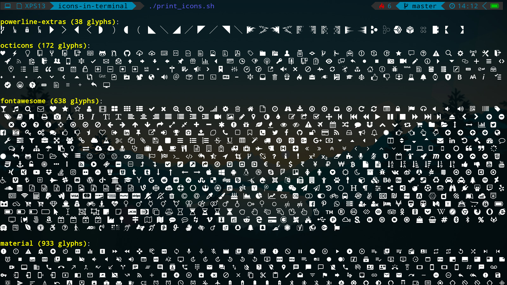

# icons-in-terminal

## Overview

`icons-in-terminal` allows you to get any font in your terminal.  
If you want to add a font, modify the file `config.json` to add its name and path.  

# Dependencies

- Python 3
- [fontforge (with python extension)](https://fontforge.github.io)

## Install

```bash
$ generate-fonts.py config.json
$ mkdir -p ~/.fonts
$ cp myicons.ttf ~/.fonts/
$ mkdir -p ~/.config/fontconfig/conf.d
$ cp sample/icons.conf ~/.config/fontconfig/conf.d
```
Then you have to modify `~/.config/fontconfig/conf.d` to replace `YOUR_TERMINAL_FONT` with the name of your terminal font, for example "Droid Sans Mono for Powerline".  
And finally:  
```bash
$ fc-cache -fvr --really-force ~/.fonts
```
You have to save the output of generate-fonts.py, the numbers are the codepoints attributed to each icon.  
For example, if I want to use the icon `ticket` from fontawesome, I check this line:  
`fontawesome: ticket : 0xe1ea`
To use it (fish doesn't interpret the code, if you use fish, run this code with bash instead):  
```bash
$ echo -e "\ue1ea"
```
To see all your icons, you can run a script to loop over each icon (it starts at 0xe000).  
Even if you rerun generate-fonts.py, the codepoints won't change, unless you modify config.json.  
If you want to add a font, add it at the end of config.json to not modify all the codepoints.  
If you modify config.json and see that icons are not printed properly, it's because (I guess) your system cached the font. To be sure reboot you system (but it shouldn't be necessary) or resize your terminal (zoom) to force the font's reload.

## How it works

This project is inspired by [awesome-terminal-fonts](https://github.com/gabrielelana/awesome-terminal-fonts) but different.  
I don't modify any existing fonts, I create a new one and insert each icon founds in the provided fonts in the [private use areas](https://en.wikipedia.org/wiki/Private_Use_Areas).  
The file `icons.conf` tells to freetype to search the font in `myicons.ttf` if it fails in your default font file. As the codepoints generated are in the private use areas, freetype should always fail and fallback to myicons.ttf

## Included icons

[octicons v4.4.0](https://octicons.github.com/)  
[fontawesome](http://fontawesome.io/)  
[material-design-icons](https://github.com/google/material-design-icons)  
[file-icons](https://atom.io/packages/file-icons)  
[weather-icons](https://erikflowers.github.io/weather-icons/)  
[font-linux](https://github.com/Lukas-W/font-linux)  
[all-the-icons](https://github.com/domtronn/all-the-icons.el)  

## Screenshot



## Todos

- Improve the poor script
- Save the generated codepoints somewhere
- Be able to shift glyph (material-design-icons are not really centered, compare to the other)
- More documentation
- Be able to resize fonts (Some could find it too small)
- Integrate with differents shells (By creating variable maybe ?)
